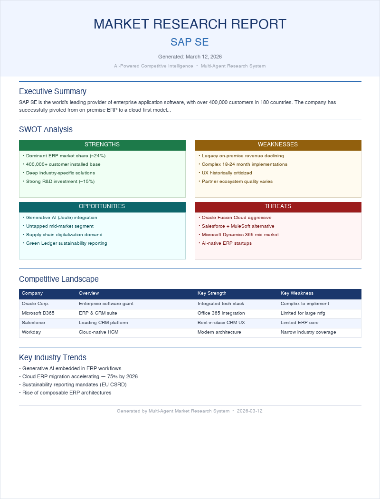

# Market Research Agent

> **Multi-agent AI system that generates professional market research reports — fully automated, from web search to formatted DOCX — in under 2 minutes.**


Uses the [Anthropic Python SDK](https://github.com/anthropics/anthropic-sdk-python) for AI-powered research and analysis.

---

## Architecture

```
┌─────────────────────────────────────────────────────────┐
│                    Orchestrator                         │
│           Coordinates the three-stage pipeline          │
└──────────────┬──────────────────────────────────────────┘
               │
       ┌───────┴────────┐
       ▼                ▼
┌─────────────┐   ┌─────────────┐
│  Research   │   │  Analysis   │
│   Agent     │   │   Agent     │
│             │   │             │
│ web_search  │   │ Structured  │
│ tool (live) │   │ Outputs     │
│             │   │ (Pydantic)  │
└──────┬──────┘   └──────┬──────┘
       │                 │
       └────────┬────────┘
                ▼
       ┌─────────────────┐
       │  Report         │
       │  Generator      │
       │  (DOCX)         │
       └─────────────────┘
```

### Agent Roles

| Agent | Responsibility | Key Feature |
|---|---|---|
| `ResearchAgent` | Searches the web for company data, competitors, trends, financials | Server-side web search tool |
| `AnalysisAgent` | Structures raw research into SWOT, competitor matrix, strategic outlook | Structured Outputs (Pydantic) |
| `ReportGenerator` | Formats analysis into a professional Word document | `python-docx` |

---

## Generated Report Contents

- Cover page with company name and date
- Executive Summary
- Company Overview
- Market Position
- **SWOT Analysis** (color-coded 2×2 matrix)
- **Competitive Landscape** (formatted comparison table)
- Key Industry Trends
- Strategic Outlook
- Risk Factors

---

## Quickstart

### 1. Clone & Install

```bash
git clone https://github.com/eugen-goebel/market-research-agent.git
cd market-research-agent

python -m venv .venv
source .venv/bin/activate  # Windows: .venv\Scripts\activate

pip install -r requirements.txt
```

### 2. Configure API Key

```bash
cp .env.example .env
# Edit .env and add your Anthropic API key
# Get one at: https://console.anthropic.com/
```

### 3. Run

```bash
# Quick test without API key (uses built-in SAP SE mock data):
python main.py --dry-run

# With API key:
python main.py "SAP SE"
python main.py "Zalando SE" --output ./reports
python main.py "Tesla Inc"
```

The report is saved to `./output/market_research_<company>_<date>.docx`.

---

## Testing

```bash
# Run the full test suite (50 tests, no API key needed)
python -m pytest tests/ -v
```

The test suite covers:
- **Model validation** — Pydantic schemas, serialization, edge cases
- **Mock data integrity** — ensures dry-run data is complete and valid
- **Report generation** — DOCX output, section presence, table structure
- **Agent logic** — web search tool usage, pause_turn handling, structured outputs
- **CLI integration** — argument parsing, dry-run mode, error handling

---

## Example Output

Running `python main.py "SAP SE"` produces a ~8-page Word document:

<p align="center">
  
</p>

---

## Project Structure

```
market-research-agent/
├── main.py                    # CLI entry point (supports --dry-run)
├── agents/
│   ├── researcher.py          # Web search intelligence gathering
│   ├── analyst.py             # Structured analysis (Pydantic models)
│   ├── orchestrator.py        # Pipeline coordinator
│   └── mock_data.py           # SAP SE sample data for --dry-run mode
├── utils/
│   └── report_generator.py    # Professional DOCX generation
├── tests/
│   ├── test_models.py         # Pydantic model validation tests
│   ├── test_mock_data.py      # Mock data integrity tests
│   ├── test_report_generator.py  # DOCX generation tests
│   ├── test_agents.py         # Agent logic tests (mocked API)
│   └── test_cli.py            # CLI integration tests
├── output/                    # Generated reports (git-ignored)
├── requirements.txt
└── .env.example
```

---

## Tech Stack

- **[Anthropic Python SDK](https://github.com/anthropics/anthropic-sdk-python)** — LLM API integration
- **Server-side Web Search** — `web_search_20260209` tool for live web results
- **Structured Outputs** — Pydantic models for guaranteed JSON schema compliance
- **Adaptive Thinking** — LLM reasons about search strategy before acting
- **[python-docx](https://python-docx.readthedocs.io/)** — Professional Word document generation
- **[Pydantic v2](https://docs.pydantic.dev/)** — Data validation and structured output parsing

---

## Key Concepts Demonstrated

- **Multi-agent architecture** — separation of concerns across specialized agents
- **Agentic tool use** — autonomous web search with `pause_turn` handling
- **Structured outputs** — guaranteed schema compliance via Pydantic
- **Extended thinking** — adaptive reasoning for better search and analysis quality
- **Pipeline orchestration** — coordinating async agents with shared state

---

## Requirements

- Python 3.11+
- Anthropic API key ([get one free](https://console.anthropic.com/))
- Internet connection (for live web search)

---

## License

MIT
